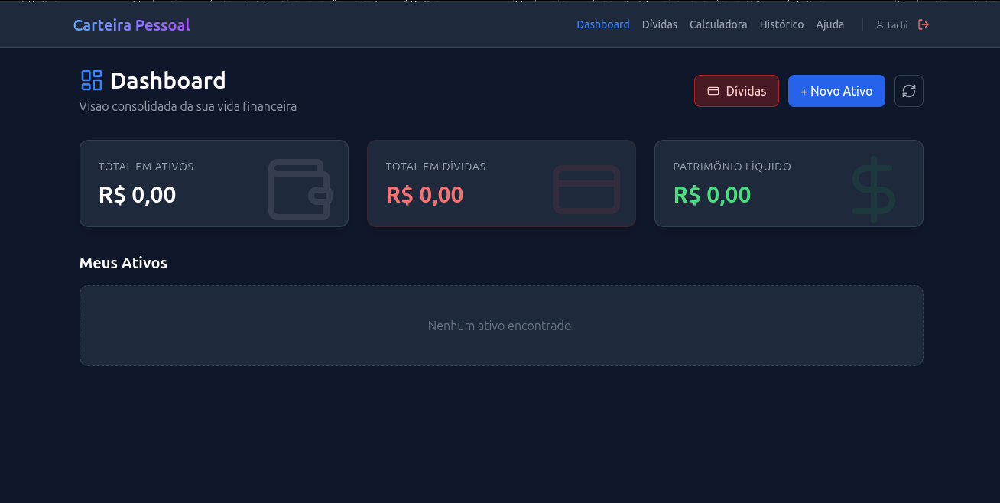

<div align="center">

# 💰 Personal Finance Manager

**Um sistema completo para gestão de patrimônio pessoal, focado no cálculo real de rentabilidade, controle de dívidas e projeções financeiras.**


[Funcionalidades](#-funcionalidades-principais) • [Tecnologias](#-tecnologias-utilizadas) • [Instalação](#-como-rodar-o-projeto) • [Segurança](#-segurança)

</div>

---

## 📖 Sobre o Projeto

Diferente de planilhas comuns, este sistema utiliza **lógica FIFO** para cálculo preciso de impostos em Renda Fixa e integrações com APIs externas para Renda Variável. O objetivo é oferecer uma visão clara de **Ativos vs. Passivos** para calcular o Patrimônio Líquido real.

### 📸 Screenshots

<div align="center">

</div>

---

## ✨ Funcionalidades Principais

### 📊 Dashboard Consolidado

- Visão clara de **Ativos vs. Passivos** (Dívidas) = Patrimônio Líquido.
- Gráficos interativos para análise de alocação de portfólio.

### 💼 Gestão de Ativos

- **Renda Fixa (CDB, LCI, LCA):** Cálculo automático de imposto regressivo e IOF.
- **Renda Variável (Ações, FIIs, Cripto):** Atualização automática de preços via APIs.
- **Lógica FIFO (First-In, First-Out):** Essencial para saques parciais e apuração correta de lucro tributável.

### 📉 Gestão de Passivos

- Controle detalhado de financiamentos e empréstimos.

### 🧮 Calculadoras Financeiras

- Juros Compostos vs. Simples.
- Projeção do "Primeiro Milhão".
- Comparador CDB vs LCI/LCA.
- Projeção futura de ativos existentes na carteira.

---

## 🚀 Tecnologias Utilizadas

### Backend

| Tech                      | Descrição                                            |
| :------------------------ | :--------------------------------------------------- |
| **Python 3.12 + FastAPI** | Performance assíncrona e tipagem forte.              |
| **SQLAlchemy**            | ORM robusto para gestão do banco de dados SQLite.    |
| **Pandas / Numpy**        | Cálculos financeiros complexos e vetorizados.        |
| **yFinance & CoinGecko**  | Cotações de B3, Stocks (USA) e Cripto em tempo real. |
| **JWT Auth**              | Sistema seguro de autenticação e proteção de rotas.  |

### Frontend

| Tech                | Descrição                                        |
| :------------------ | :----------------------------------------------- |
| **React 19 + Vite** | Interface reativa, rápida e moderna.             |
| **TailwindCSS**     | Estilização responsiva com **Dark Mode** nativo. |
| **Recharts**        | Biblioteca de gráficos customizáveis.            |
| **Lucide React**    | Ícones leves e modernos.                         |

### Infraestrutura

- **Docker Compose:** Containerização completa (Backend + Frontend) para fácil deploy.

---

## 🛠️ Como Rodar o Projeto

### Pré-requisitos

- [Docker](https://www.docker.com/) e Docker Compose instalados.

### 🐳 Rodando com Docker (Recomendado)

1. **Clone o repositório:**

   ```bash
   git clone [https://github.com/OnlyTachi/personal-finance-manager.git](https://github.com/OnlyTachi/personal-finance-manager.git)
   cd personal-finance-manager

   ```

2. **Execute o container:**

   ```bash
   docker-compose up --build
   ```

3. **Acesse a aplicação:**

   - 📱 Frontend: `http://localhost:5173`
   - ⚙️ Backend API Docs: `http://localhost:8000/docs`

## Instalaçao manual

#### Backend

```bash
cd backend
python -m venv venv
source venv/bin/activate  # Windows: venv\Scripts\activate
pip install -r requirements.txt
uvicorn app.main:app --reload
```

#### Frontend

```bash
cd frontend
npm install
npm run dev
```

---

## 🛡️ Segurança

> [\!WARNING] > **Atenção:** Este projeto foi desenvolvido para **uso pessoal local**.

A chave de criptografia (`SECRET_KEY`) presente nos arquivos de configuração padrão deve ser alterada imediatamente caso você pretenda fazer o deploy em um ambiente de produção ou exposto à internet.

---

## 📝 Licença

Este projeto está sob a licença MIT. Consulte o arquivo [LICENSE](https://www.google.com/search?q=LICENSE) para mais detalhes.

---

<div align="center">
Feito com 💜 por <a href="https://www.google.com/search?q=https://github.com/OnlyTachi">OnlyTachi</a>
</div>
